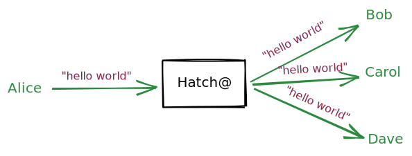

hatch@
======

Hatch@ (hatchat) is a message broker system designed for simplicity.

Hatch@ is built on top of Postgres, so that you can integrate with your existing databases, or treat as an external system.

Although Hatch@ does not provide end-to-end encryption out of the box, it is designed with privacy and security in mind (albeit by an amateur). Part of this design uses a somewhat unusual authentication system, where the clients register an account with Hatch@, then self-sign all subsequent requests.

Hatch@ uses long-polling to provide real-time updates. It may not be the most efficient method, but it _is_ dead simple.

## API

Hatch@ exposes the following endpoints. All HTTP endpoints expect `Content-Type: application/json`. Authentication uses JWT in the format: `b64({ header }).b64({ id: "user-id" }).signature` where the signature is created by signing the prior parts, with the users private key.

`POST /users` registers a new user.
- `id` uuid string.
- `publicKey` RSA public key string in `PEM` format
- `username` regular ol' string

`PATCH /users/:id` allows the owner of a user to update some attributes.
- `username` regular ol' string

`DELETE /users/:id` allows the owner of a user to delete that account.

`GET /users/:id` allows any user to view the `{ id, publicKey, username }` of another user.

`POST /channels` creates a new channel
- `id` any string, must be unique across other channels
- `inviteModel` must be a string with value "owner" (only the owner/creator of the channel may invite members), "member" (only members of the channel may invite other members), "self" (anyone can join / you invite yourself)

`PATCH /channels/:id` allows the owner of a channel to update the channel.
- `inviteModel` must be a string with value "owner", "member" or "self"

`DELETE /channels/:id` allows the owner of a channel to delete the channel.

`GET /channels/:id` allows the members of the channel to to list details of that channel (including other members).

`GET /channels` shows a user which channels they are a member of.

`POST /invite` invites a user to a channel, the invite must match the `inviteModel`.
- `channelId` id of channel
- `userId` uuid string

`POST /messages` send a message to a channel
- `channelId` id of channel
- `payload` json

`GET /messages` get messages from a channel. This endpoint is intended for long-polling, as a result, if no messages match the window specified, it will hang for up to 30s before returning either, some messages or an empty array. Messages are returned in ascending order of their `createdAt`.
- `channelId` id of channel
- `since` ISO timestamp or `-infinity` to indicate "beginning of time"
- `until` ISO timestamp or `infinity` to indicate "end of time"
- `limit` number of rows to return at a time
